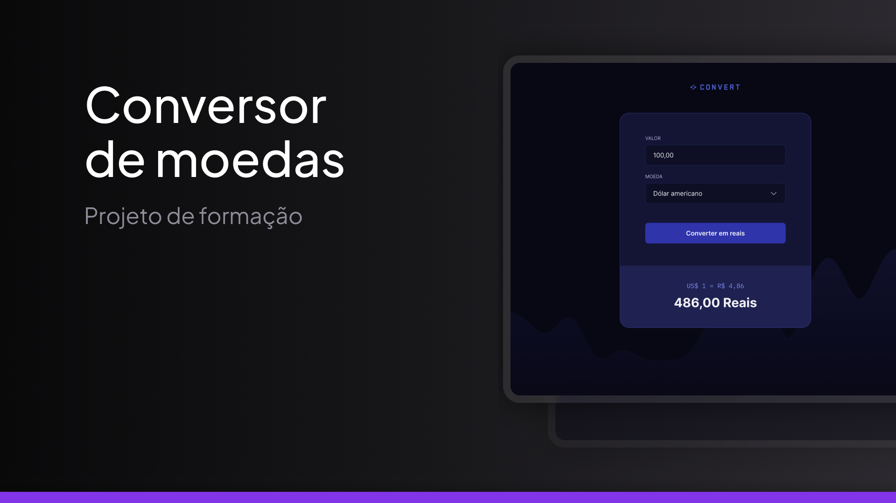

<h1 align="center"> Convert </h1>

Uma página conversora de moedas feita como forma de estudos do curso Fullstack da Rocketseat

<a href="https://guilhermedkdk.github.io/js-convert/">🔗 Live Preview</a>&nbsp;&nbsp;&nbsp;|&nbsp;&nbsp;&nbsp;
<a href="#-tecnologias">🚀 Tecnologias</a>&nbsp;&nbsp;&nbsp; |&nbsp;&nbsp;&nbsp;&nbsp;
<a href="#-projeto">💻 Projeto</a>&nbsp;&nbsp;&nbsp;|&nbsp;&nbsp;&nbsp;
<a href="#-aprendizados">📚 Aprendizados</a>

## 🚀 Tecnologias

Esse projeto foi desenvolvido com as seguintes tecnologias:

- JavaScript
- Git e Github
- FIGMA

## 💻 Projeto

O "Convert" foi um mini projeto do curso Fullstack da Rocketseat no módulo "JavaScript", onde utilizei variáveis, operadores, funções, DOM e eventos para desenvolver uma aplicação de conversão de moedas.

## 📚 Aprendizados

Este projeto foi feito dentro do curso de Fullstack no módulo "JavaScript" da Rocketseat.
Nele pude consolidar os conhecimentos sobre:

### JavaScript
- Variáveis
- Operadores
- Condicionais
- Funções
- DOM
- Eventos
